上大学的时候在某宝上面买了一台晶体管电吉他音箱【Mr.7 MG-20】，用了一段时间。后来觉得音色实在是不好听（失真很差），底噪也有点大，就又买了一台电子管电吉他音箱【Marshall SL-5C Slash Signature Combo】，效果确实很好，于是这台【Mr.7 MG-20】就一直闲置了。

前些时候看到了这台音箱，想着放着也占地儿，还不如去海鲜市场卖掉，试了下发现不出声音了，只有很大的工频的底噪（电流声），于是就继续吃灰。最近又搬家了，居然还没把它扔掉，想着反正闲来无事，干脆就修一修吧，反正音箱电路也不复杂。

<!--more-->

上某宝搜了下这个音箱品牌【Mr.7】已经没了，应该是倒闭了。能搜到的信息只有【数码之家】有人发过帖子[Mr.7 MG20 吉他音箱拆解 让人失望的电路元件](https://www.mydigit.cn/thread-119495-1-1.html)，其中图片都加载不出来了，有大佬留言这个音箱是仿的【Marshall MG10】。

顺腾摸瓜找到了【Marshall MG10】的信息 [Marshall MG10 Amplifier Analysis](https://www.electrosmash.com/marshall-mg10)，其中有电路图可以参考。

# 准备

拆音箱所需要准备的工具：
* 十字螺丝刀
* 六角螺丝刀或者扳手（10mm、14mm）
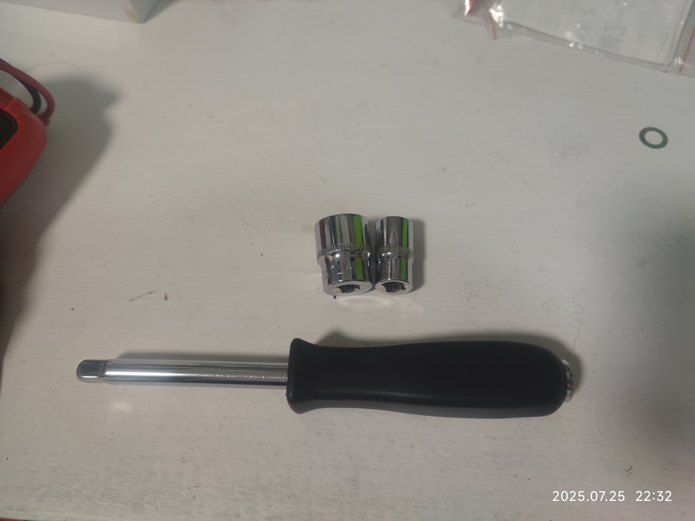

# 排查

尝试上电发现 LED 能正常闪烁，只是不出声音，调节旋钮无效。说明电源部分大概还是正常的。功率放大 IC 看起来型号是 UTC2030，查了下与 TDA2030A 是完全相同的，外观没有明显烧坏的痕迹。

找到引脚定义和放大电路图。
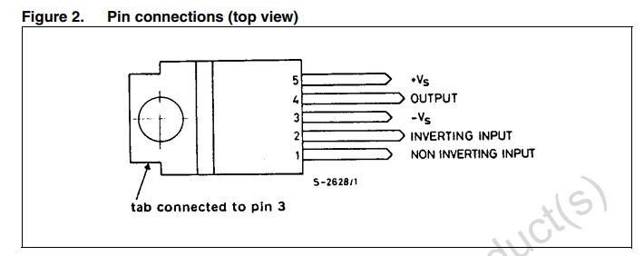

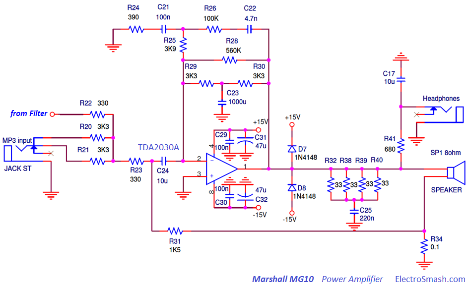

根据电路图，先检查一下电源和输出：用万用表测了下 +Vs -Vs 正常连接到了+-15V电源，OUTPUT 正常连接到了扬声器（用万用表测这个扬声器的电阻 3.xΩ，推测阻抗是 4Ω）。

输入电路有点复杂，但是注意到 MP3 Input 基本上是直接输入到了 UTC2030，于是找了根线插到我的古董手机上面，播放音乐，居然有声音，说明功率放大这一部分是没有大问题的。

插上吉他试了下还是没有声音，瞎动了一会儿旋钮，突然又有声音了，但是似乎大小不受控制，失真开关也不好使，这样看来问题大概率出在旋钮和自锁开关上面。

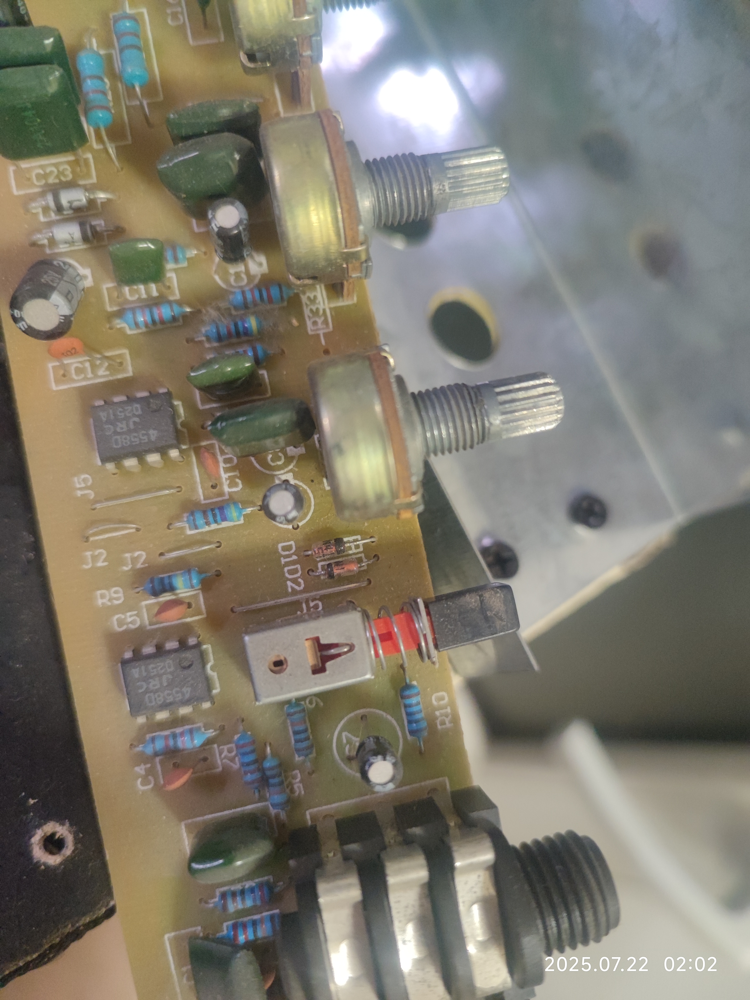

断电后直接用万用表测电位器两端的电阻，有个别电位器测出来居然有几 MΩ，个别电位器测着阻值正常范围内但是会乱跳（不线性）。再测自锁开关，两个状态都是时开时断。这样一来问题就锁定到了这几个机械元件上，可能日历寿命差不多到了（快 10 年了），直接全部换掉。

# 准备元件

电位器：
* WH148 B100K * 2
* WH148 B10K * 1
* WH148 B20K * 2

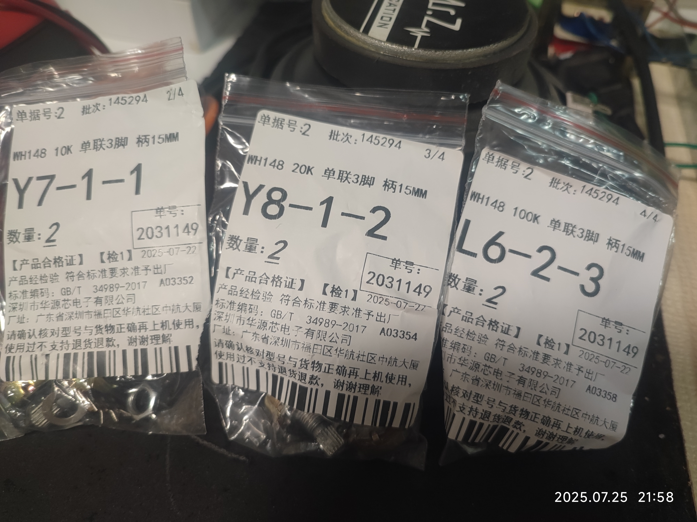

自锁开关：
* PS-22F03 * 1

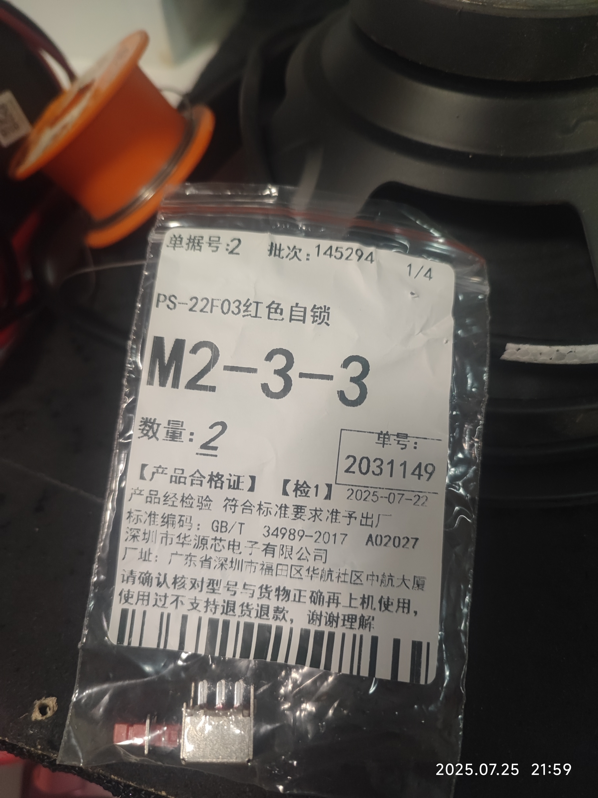

# 更换

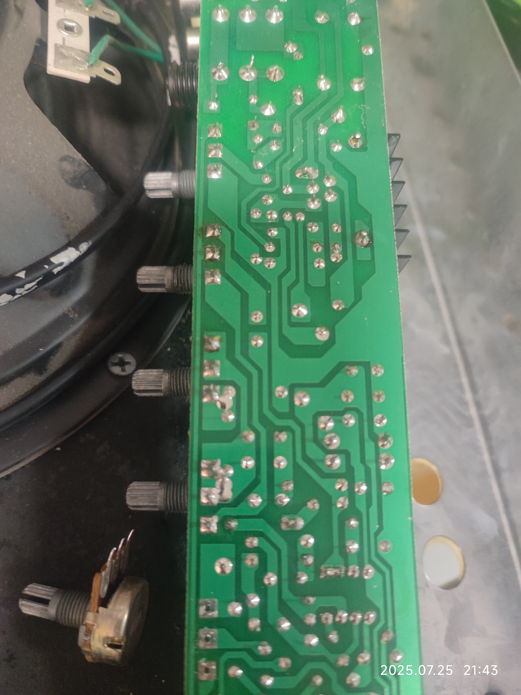
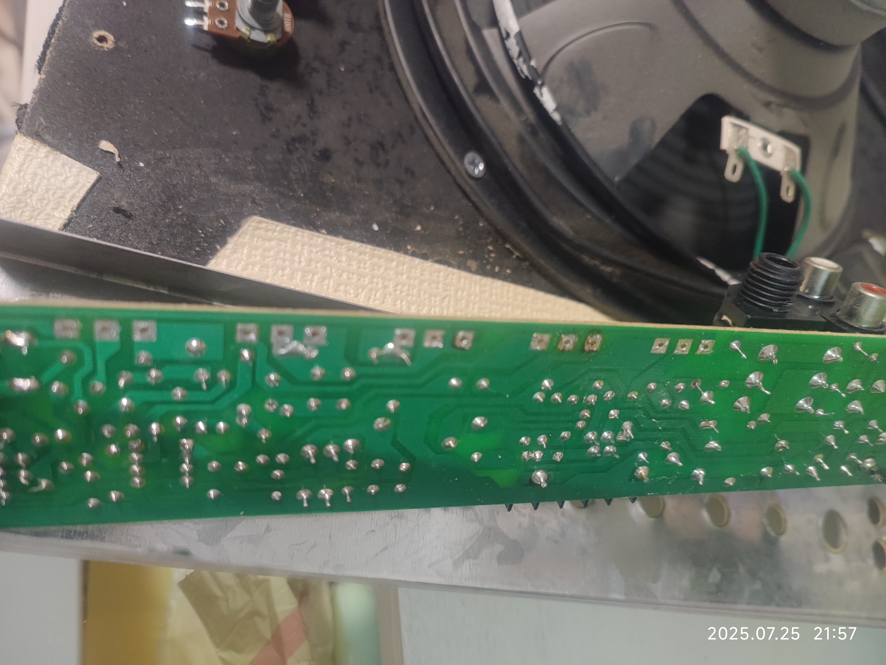
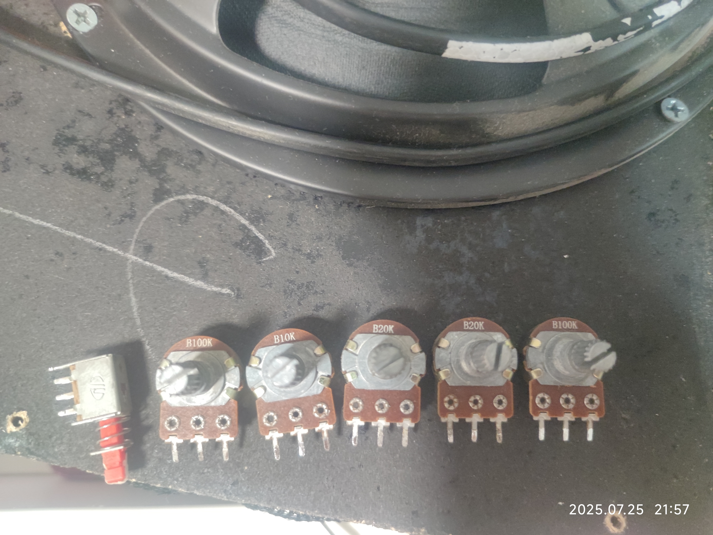
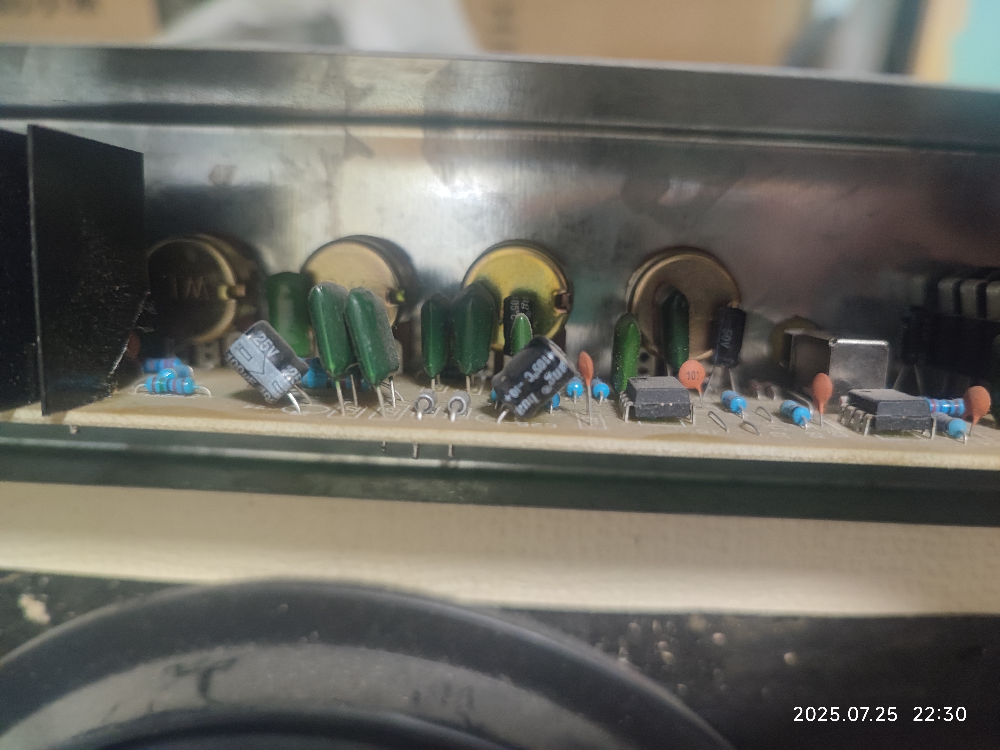
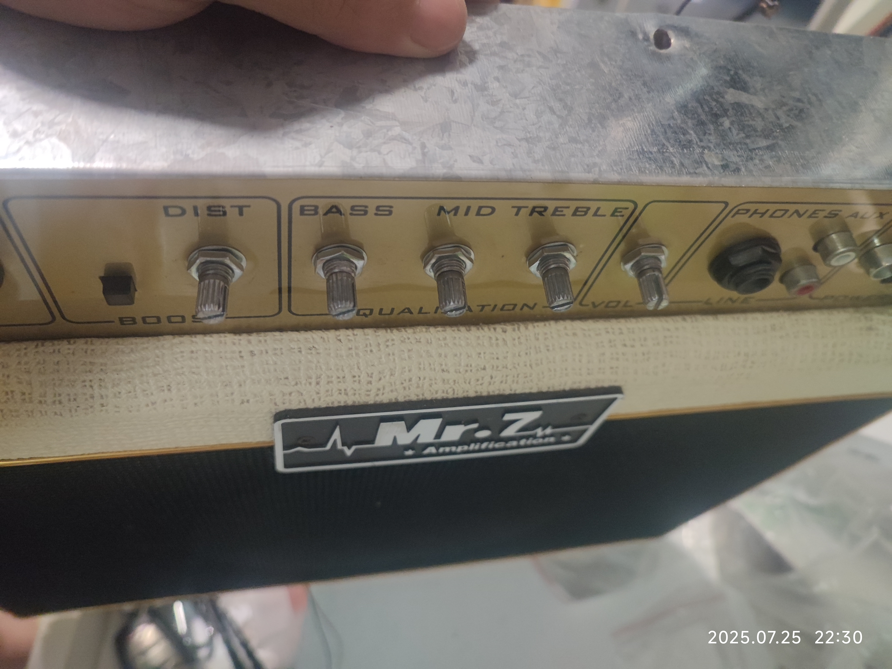

# 测试

测试发现工频的底噪没了，旋钮调节灵敏，问题解决。

# 题外话

分析电路的时候发现这个音箱的电源部分偷工减料了。

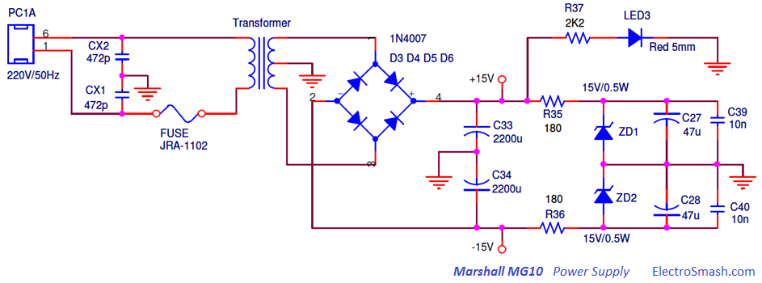

上面是【Marshall MG-10】的电源部分的电路图，其中使用了两个电阻 R35、R36 配合齐纳二极管 ZD1、ZD2 做稳压，消除整流之后的纹波。而这台【Mr.7 MG-20】直接把 +15V/-15V 右边的电路删除了，只保留了 C33 和 C34 电容进行滤波，这大概也是这台音箱的噪音相对大的原因之一。