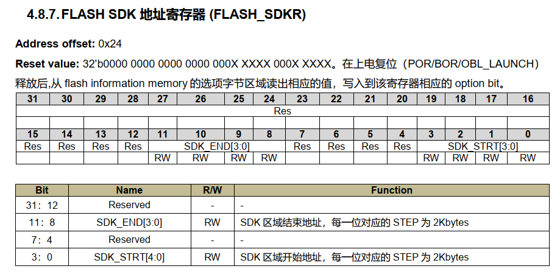

众所周知，PY32F002B 的闪存保护有三种机制：

1.SDK 保护（特定程序区的访问保护）

2.WRP 写保护

3.Option byte 写保护

对于想要保护自己的程序不被他人直接读取的同学，需要使用【SDK 保护】机制。

<!--more-->



# SDK 保护开启
锁定很简单，保护整个闪存区域的话，设置
```
SDK_START = 0x0
SDK_END = 0xB
```
即可，C 代码如下。
```
void OpenSDKFlashProtection(void) {
    FLASH_OBProgramInitTypeDef config;
    LL_FLASH_OBGetConfig(&config);
    if (config.SDKEndAddr == 0) {
        LL_FLASH_Unlock();
        LL_FLASH_OB_Unlock();
        // Protect the entire program flash
        config.OptionType   = OPTIONBYTE_SDK;
        config.SDKStartAddr = 0x0;
        config.SDKEndAddr   = 0xB;
        if (LL_FLASH_OBProgram(&config)) {
            APP_ErrorHandler();
        }
        if (LL_FLASH_OB_Launch()) {
            APP_ErrorHandler();
        }
        LL_FLASH_OB_Lock();
        LL_FLASH_Lock();
    }
}
```
**注意操作 Flash 一定要先解锁再修改，否则会不成功。**

# SDK 保护关闭

关闭 SDK 保护这里有个坑，不小心开启以后尝试了好久才解锁。
经过试验，直接写入 ```SDK_END = 0x0``` 并不能实现解锁。
一个可行的方式是写入
```
SDK_START = 0xF
SDK_END = 0x0
```

对应的 C 代码如下：

```
void CloseSDKFlashProtection(void)
{
    LL_FLASH_Unlock();
    LL_FLASH_OB_Unlock();
    // Unprotect the entire program flash
    FLASH_OBProgramInitTypeDef config;
    config.OptionType   = OPTIONBYTE_SDK;
    config.SDKStartAddr = 0xF;
    config.SDKEndAddr   = 0x0;
    if (LL_FLASH_OBProgram(&config)) {
        APP_ErrorHandler();
    }
    if (LL_FLASH_OB_Launch()) {
        APP_ErrorHandler();
    }
    LL_FLASH_OB_Lock();
    LL_FLASH_Lock();
}
```

注意：根据手册，解锁 SDK 会擦除整个程序空间的闪存，测试结果确实如此。

# 使用调试工具解锁 SDK 保护

如果你不小心把 SDK 保护开启了且没有办法关闭，无法下载程序（就像我一样-_-），可以使用调试工具解锁，原理就是模拟 C 语言按顺序写入对应的寄存器地址。下面以 Jlink 为例，给出了解锁序列:

```
write4 0x40022008 0x45670123  // Unlock flash key 0
write4 0x40022008 0xCDEF89AB  // Unlock flash key 1
write4 0x4002200C 0x08192A3B  // Unlock option byte key 0
write4 0x4002200C 0x4C5D6E7F  // Unlock option byte key 1
write4 0x40022024 0x0000000F  // Write FLASH_SDKR to SDK_BEGIN=0xF and SDK_END=0x0
write4 0x40022014 0x00020000  // Start to modify flash option bytes
write4 0x40022080 0xff        // Trigger program
mem32  0x40022024 1           // Show FLASH_SDKR
write4 0x40022014 0x08000000  // Reload program option byte

// Start normal program sequences
erase
...
loadfile ...
...
exit
```